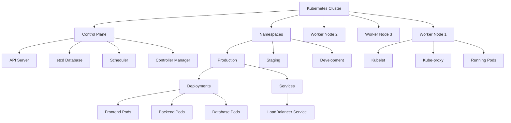

# **Kubernetes Beginner's Guide**

---

## **Introduction to Kubernetes**

**Kubernetes** (often abbreviated as **k8s**) is an **open-source platform** that automates the deployment, scaling, and management of **containerized applications**. It ensures that your apps are running reliably and efficiently.

Think of Kubernetes as a **conductor** of an orchestra, managing containers across a cluster of machines.

### **Key Benefits of Kubernetes:**
- **High Availability**: Keeps applications running even when failures occur.
- **Scalability**: Automatically adjusts the app size based on demand.
- **Rolling Updates**: Allows updates without downtime.
- **Self-healing**: Replaces failed containers automatically.

---

## What is Orchestration?
Imagine you're conducting an orchestra - each musician needs to play their part at the right time in harmony. Similarly, Kubernetes orchestration means:

- Automatically placing application containers on servers
- Managing multiple containers across multiple servers
- Scaling containers up or down based on demand
- Ensuring applications are running as intended
- Handling failures automatically

## **How Kubernetes Works**
Kubernetes runs containers across a cluster of **nodes** (machines) and ensures optimal resource utilization and performance.

Imagine Kubernetes as a manager that:
- **Schedules** where containers should run.
- **Monitors** container health.
- **Fixes** any issues by restarting or rescheduling containers.

---

## **Core Concepts in Kubernetes**

### 1. **Cluster**
A Kubernetes **cluster** is a group of machines (physical or virtual) that work together as one system. The cluster consists of:
- **Control Plane**: The brain of the cluster.
- **Worker Nodes**: Machines where applications run.

### 2. **Pods**
A **pod** is the smallest and simplest unit in Kubernetes. A pod:
- Contains one or more **containers**.
- Shares the same network and storage resources.

Example:
- A web application might run inside a pod.

### 3. **Control Plane**
The **control plane** is the brain of Kubernetes. It manages the cluster and makes scheduling decisions. Key components include:
- **API Server**: Main point of communication for managing the cluster.
- **Scheduler**: Assigns pods to worker nodes.
- **Controller Manager**: Handles tasks like restarting failed pods.
- **etcd**: Stores cluster data (key-value store).

### 4. **Worker Nodes**
Worker nodes are machines that run applications. Each worker node includes:
- **Kubelet**: Ensures pods are running as expected.
- **Container Runtime**: Runs containers (e.g., Docker, containerd).
- **Kube-proxy**: Handles networking between pods and services.

### 5. **Services**
A **service** provides a stable way to connect to pods, even if pods are replaced or rescheduled.

#### Types of Services:
- **ClusterIP**: Internal cluster communication.
- **NodePort**: Exposes an app on a specific port of the node.
- **LoadBalancer**: Exposes the app externally via a cloud provider's load balancer.

### 6. **Kubernetes API**
The **Kubernetes API** is the main way to interact with the cluster. Tools like **`kubectl`** (command-line tool) use the API to manage resources.

Example: Creating a pod, scaling applications, or deploying services.

---

## **How Kubernetes Components Work Together**

1. **Define Requirements**:
   - Use a **YAML** file to describe the desired state (e.g., run 3 replicas of an app).

2. **Control Plane Scheduling**:
   - The control plane assigns pods to available worker nodes.

3. **Worker Nodes Run Applications**:
   - Containers are deployed in pods on worker nodes.

4. **Monitoring and Healing**:
   - Kubernetes automatically detects and replaces failed pods or nodes.

---

## **Visual Analogy**

Imagine Kubernetes as a **factory**:
- The **Control Plane** is the factory manager making decisions.
- The **Worker Nodes** are the factory workers doing the tasks.
- **Pods** are machines on the assembly line.
- **Services** are the delivery trucks ensuring products reach customers.
- The **Kubernetes API** is the control system where you give instructions.

---

## **Why Kubernetes is Powerful**
- **Self-healing**: Automatically replaces failed pods or nodes.
- **Scalability**: Adjusts resource allocation based on demand.
- **Portability**: Works on any cloud provider, on-premises, or laptops.
- **Flexibility**: Manages web apps, databases, machine learning workloads, and more.

---

## **Summary of Kubernetes Hierarchy**

| **Component**     | **Purpose**                                     |
|-------------------|-----------------------------------------------|
| **Cluster**       | Control Plane + Worker Nodes.        |
| **Control Plane** | Manager for everything.     |
| **Worker Nodes**  | Machines (VMs) where application pods run.           |
| **Pods**          | App instance (with 1+ containers).                |
| **Services**      | Provides stable access to pods.                |
| **Containers**    | Application code packaged with dependencies.   |

---

## **Hierarchy Diagram**

---

## **Conclusion**
Kubernetes simplifies container management by automating deployment, scaling, and self-healing. It works across cloud platforms and is essential for modern, scalable applications.

By understanding concepts like **pods**, **services**, and the **control plane**, you can efficiently manage containerized workloads with Kubernetes.

---

**End of Guide**
